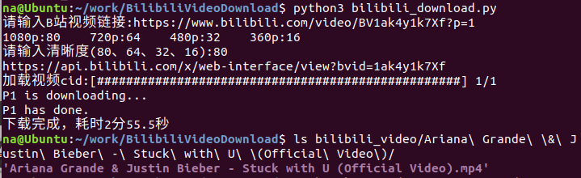
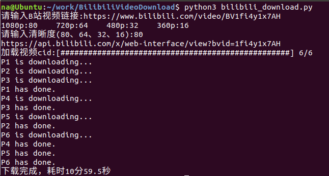
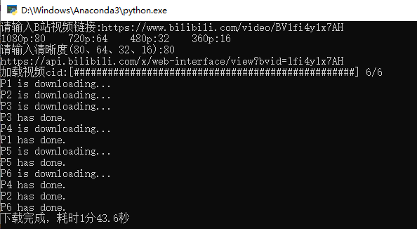

## 使用说明

```bash
# 克隆仓库
git clone https://github.com/Sanzona/BilibiliVideoDownload.git

cd BilibiliVideoDownload

# 安装依赖
pip3 install -r requirements.txt
apt install ffmpeg
# wget -O ~/.imageio/ffmpeg/ffmpeg-linux64-v3.3.1  https://github.com/imageio/imageio-binaries/raw/master/ffmpeg/ffmpeg-linux64-v3.3.1 

python3 bilibili_download.py
```

单p下载：



多p下载：



